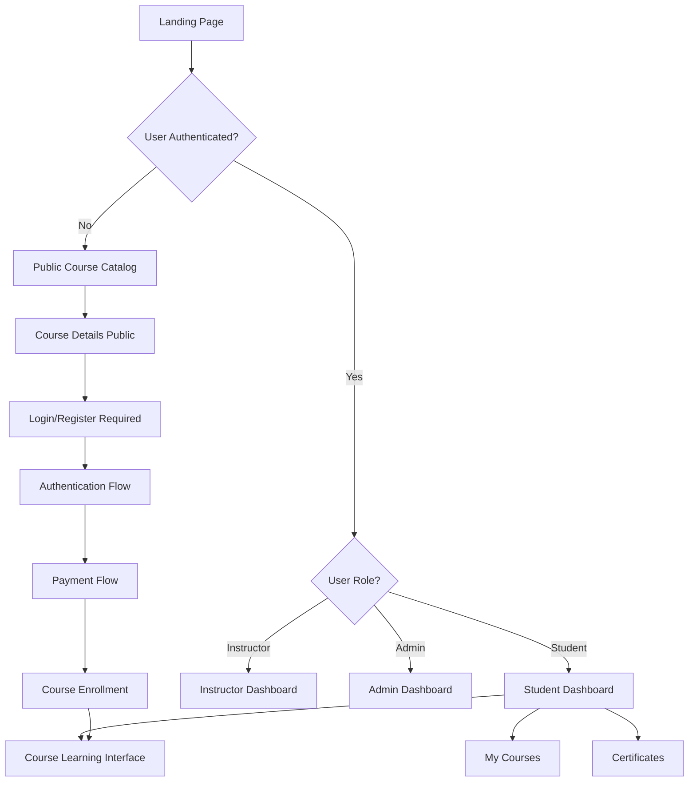

# LMS UI Logic 

## 🎯 Frontend Architecture Overview

Based on your updated backend structure, here's the complete UI logic that maps to your API endpoints:



---

## 🌐 UNAUTHENTICATED USER FLOW

### 1. Landing Page (`/`)
**Purpose**: Attract visitors and showcase platform value

#### Components & Features:
```typescript
// Landing Page Components
- Header: Logo, Navigation (Courses, About), Login/Register buttons
- Hero Section: Main headline, value proposition, CTA
- Featured Courses: Top 6-8 courses grid
- Stats Section: Students count, courses count, success rate
- How it Works: 3-step learning process
- Testimonials: Student success stories
- Footer: Links, contact info

// API Calls:
GET /api/courses?published=true&limit=8  // Featured courses
```

#### User Actions:
- Browse featured courses
- Navigate to course catalog
- Access login/register pages
- View course details (limited)

### 2. Course Catalog (`/courses`)
**Purpose**: Course discovery and browsing

#### Features & Filters:
```typescript
// Course Catalog Features
- Search Bar: Search by title/description
- Category Filter: Programming, Design, Business, etc.
- Price Filter: Free, Paid, Price Range
- Level Filter: Beginner, Intermediate, Advanced
- Sort Options: Popular, Newest, Price (Low-High), Price (High-Low)

// Course Card Information:
- Course thumbnail
- Title and description (truncated)
- Instructor name and avatar
- Price (Free or $XX)
- Student count and rating
- Course duration/lessons count
- "View Details" button

// API Calls:
GET /api/courses?published=true           // All courses
GET /api/courses?category=programming     // Filtered by category
GET /api/courses?search=javascript        // Search results
```

### 3. Course Details - Public View (`/courses/:id`)
**Purpose**: Detailed course information for decision making

#### What Visitors See:
```typescript
// Course Hero Section
- Course banner/thumbnail
- Course title and subtitle
- Instructor profile (name, bio, avatar)
- Course stats (students enrolled, lessons, duration)
- Price and enrollment CTA

// Course Information Tabs
- Overview: Description, learning objectives
- Curriculum: Lesson titles (no content access)
- Instructor: Full instructor bio and credentials
- Reviews: Student testimonials (if available)

// Enrollment CTA
- "Enroll Now" button → Redirects to registration
- "Sign In to Enroll" if they have account

// API Calls:
GET /api/courses/:id                    // Course details
GET /api/users/:instructorId           // Instructor info
GET /api/courses/:id/lessons           // Lesson titles only
```

#### Restrictions:
- ❌ Cannot access lesson content
- ❌ Cannot watch videos
- ❌ Cannot take quizzes
- ✅ Can see course structure
- ✅ Can view instructor profile

### 4. Authentication Flow

#### Registration Page (`/register`)
```typescript
// Registration Form
- Full Name (required)
- Email Address (required, unique validation)
- Password (required, strength validation)
- Confirm Password (required, match validation)
- Terms & Conditions checkbox
- "Create Account" button
- "Already have account? Sign In" link

// API Integration:
POST /api/auth/register
Body: { name, email, password }
Response: { success, data: { user, accessToken, refreshToken } }

// Post-Registration Flow:
1. Store JWT tokens in localStorage
2. Set user context
3. Redirect based on intended action:
   - If came from course page → Redirect to enrollment
   - Otherwise → Redirect to student dashboard
```

#### Login Page (`/login`)
```typescript
// Login Form
- Email Address (required)
- Password (required)
- "Remember Me" checkbox
- "Sign In" button
- "Forgot Password?" link
- "Don't have account? Sign Up" link

// API Integration:
POST /api/auth/login
Body: { email, password }
Response: { success, data: { user, accessToken, refreshToken } }

// Post-Login Redirection Logic:
switch(user.role) {
  case 'admin': navigate('/admin/dashboard')
  case 'instructor': navigate('/instructor/dashboard')
  case 'student': 
  default: navigate(intendedRoute || '/dashboard')
}
```

---

## 👤 AUTHENTICATED USER FLOWS

### Universal Components for All Authenticated Users:

#### Authenticated Header
```typescript
// Different navigation based on role
const AuthenticatedHeader = ({ user }) => (
  <header className="authenticated-header">
    <Logo />
    <Navigation role={user.role} />
    <UserDropdown user={user} />
    <ThemeToggle />
  </header>
);

// Role-based Navigation Items
const navigationItems = {
  student: [
    { label: 'Dashboard', path: '/dashboard' },
    { label: 'My Courses', path: '/my-courses' },
    { label: 'Browse Courses', path: '/courses' },
    { label: 'Certificates', path: '/certificates' }
  ],
  instructor: [
    { label: 'Dashboard', path: '/instructor/dashboard' },
    { label: 'My Courses', path: '/instructor/courses' },
    { label: 'Create Course', path: '/instructor/courses/new' },
    { label: 'Analytics', path: '/instructor/analytics' },
    { label: 'Browse Courses', path: '/courses' }
  ],
  admin: [
    { label: 'Dashboard', path: '/admin/dashboard' },
    { label: 'Users', path: '/admin/users' },
    { label: 'Courses', path: '/admin/courses' },
    { label: 'Payments', path: '/admin/payments' },
    { label: 'Analytics', path: '/admin/analytics' }
  ]
};
```

---

## 🎓 STUDENT USER FLOW

### 1. Student Dashboard (`/dashboard`)
**Purpose**: Central hub for student activities

#### Dashboard Sections:
```typescript
// Welcome Section
- Personalized greeting: "Welcome back, [Name]!"
- Quick stats: Enrolled courses, completed courses, certificates earned
- Current streak or learning goals

// Continue Learning Section  
- Courses with progress < 100%
- "Continue" buttons leading to last accessed lesson
- Progress bars showing completion percentage

// Recently Enrolled
- Newly enrolled courses
- "Start Learning" buttons for unstarted courses

// Recommended Courses
- Personalized recommendations based on enrolled courses
- Popular courses in same categories

// Achievements/Certificates
- Recently earned certificates
- Learning milestones achieved

// API Calls:
GET /api/auth/me                        // Current user
GET /api/courses/enrolled               // Student's enrolled courses
GET /api/certificates?userId=:id        // User's certificates
```

### 2. My Courses Page (`/my-courses`)
**Purpose**: Manage enrolled courses and track progress

#### Features:
```typescript
// Filter Tabs
- All Courses
- In Progress (0% < progress < 100%)
- Completed (progress = 100%)
- Not Started (progress = 0%)

// Course Cards
- Course thumbnail and title
- Instructor name
- Progress bar with percentage
- Last accessed date
- Action buttons:
  - "Continue Learning" (if progress > 0)
  - "Start Course" (if progress = 0)
  - "Review Course" (if completed)
  - "Download Certificate" (if completed)

// Sorting Options
- Recently Accessed
- Progress (High to Low)
- Alphabetical
- Enrollment Date

// API Calls:
GET /api/courses/enrolled               // All enrolled courses with progress
```

### 3. Course Enrollment Flow

#### Course Details - Authenticated View (`/courses/:id`)
```typescript
// Enhanced Course Details for Authenticated Users
- All public features PLUS:
- Preview of first lesson (if available)
- Enrollment button with payment integration
- Access to course if already enrolled

// Enrollment States:
1. Not Enrolled + Free Course:
   - "Enroll Free" button → Direct enrollment

2. Not Enrolled + Paid Course:
   - "Enroll for $XX" button → Payment flow

3. Already Enrolled:
   - "Continue Learning" button → Go to learning interface
   - Course progress indicator

// API Integration:
GET /api/courses/:id                    // Course details
POST /api/courses/:id/enroll           // Enroll in course (free)
POST /api/payments/initialize          // Start payment process (paid)
```

#### Payment Flow Integration
```typescript
// Payment Flow for Paid Courses
1. User clicks "Enroll for $XX"
2. Payment modal opens with course confirmation
3. Initialize payment via API
4. Redirect to Paystack payment page
5. Paystack redirects back with reference
6. Verify payment and complete enrollment
7. Redirect to learning interface

// Payment Modal States:
- Confirmation: Course details and price
- Processing: "Redirecting to payment..."
- Success: "Enrollment successful!"
- Error: Payment failed, retry option

// API Calls:
POST /api/payments/initialize
Body: { courseId }
Response: { paymentUrl, reference }

GET /api/payments/verify?reference=:ref
Response: { status, enrollment }
```

### 4. Course Learning Interface (`/courses/:id/learn`)
**Purpose**: Main learning experience

#### Layout Structure:
```typescript
// Three-Panel Layout
- Left Sidebar: Course navigation and progress
- Main Content: Current lesson content
- Right Panel (optional): Notes, resources

// Sidebar Components:
- Course title and progress bar
- Lessons list with:
  - Lesson titles
  - Completion indicators (✓ completed, • current, ○ upcoming)
  - Duration estimates
  - Quiz indicators
  - Click navigation

// Main Content Area:
- Lesson title and description
- Video player (if lesson has video)
- Text content (formatted)
- Quiz component (if lesson has quiz)
- Navigation buttons (Previous/Next)

// Progress Tracking:
- Auto-save progress as user moves through content
- Mark lessons as completed
- Update overall course progress

// API Calls:
GET /api/courses/:id/lessons           // All course lessons
GET /api/lessons/:id                   // Specific lesson content
GET /api/lessons/:id/quizzes          // Lesson quizzes
POST /api/quizzes/:id/submit          // Submit quiz answers
```

#### Lesson Content Types:
```typescript
// Video Lessons
- HTML5 video player with controls
- Resume from last watched position
- Track video completion percentage
- Automatic lesson completion when video ends

// Text Lessons
- Formatted content display
- Reading progress tracking
- Manual "Mark as Complete" button

// Quiz Lessons
- Multiple choice questions
- Immediate feedback on submission
- Required passing score to proceed
- Retry mechanism for failed attempts

// Mixed Content
- Video + text + quiz in single lesson
- Progressive completion tracking
```

### 5. Certificates Page (`/certificates`)
**Purpose**: View and download earned certificates

#### Features:
```typescript
// Certificates Grid
- Certificate preview images
- Course name and completion date
- Download PDF button
- Share on social media options
- Print certificate option

// Filter Options
- All Certificates
- Recent (last 30 days)
- By Course Category

// API Calls:
GET /api/certificates?userId=:id       // User's certificates
```

---

## 👨‍🏫 INSTRUCTOR USER FLOW

### 1. Instructor Dashboard (`/instructor/dashboard`)
**Purpose**: Instructor activity overview and quick actions

#### Dashboard Sections:
```typescript
// Overview Stats
- Total courses created
- Total students enrolled across all courses
- Recent enrollments
- Revenue/earnings (if applicable)

// My Courses Summary
- Published courses count
- Draft courses count
- Quick access to course management

// Recent Activity
- New student enrollments
- Course completion notifications
- Student quiz results/progress

// Quick Actions
- "Create New Course" button
- "Manage Existing Courses" button
- "View Analytics" button

// API Calls:
GET /api/courses?instructorId=:userId  // Instructor's courses
// Additional analytics endpoints as needed
```

### 2. Course Management (`/instructor/courses`)
**Purpose**: Manage all instructor's courses

#### Features:
```typescript
// Course List View
- Course cards with:
  - Thumbnail and title
  - Publication status (Published/Draft)
  - Student enrollment count
  - Last updated date
  - Action buttons (Edit, Manage Lessons, Analytics, Delete)

// Filters
- All Courses
- Published
- Draft
- By Category

// Actions
- "Create New Course" button
- Bulk actions (if needed)

// API Calls:
GET /api/courses?instructorId=:userId  // Instructor's courses
DELETE /api/courses/:id               // Delete course
```

### 3. Course Creation/Editing (`/instructor/courses/new` or `/instructor/courses/:id/edit`)
**Purpose**: Create and modify course content

#### Course Builder Sections:
```typescript
// 1. Basic Information
- Course title and description
- Category selection
- Price setting (Free or paid amount)
- Thumbnail upload
- Course tags/keywords

// 2. Curriculum Builder
- Add/edit/reorder lessons
- Lesson types: Video, Text, Quiz, Mixed
- Drag-and-drop lesson ordering
- Lesson duration estimates

// 3. Lesson Content Editor
- Rich text editor for text content
- Video upload integration (Cloudinary)
- Quiz builder with multiple choice questions
- Preview functionality

// 4. Publishing
- Course preview
- Publish/unpublish toggle
- Save as draft option

// API Calls:
POST /api/courses                     // Create new course
PUT /api/courses/:id                 // Update course
POST /api/courses/:id/lessons        // Add lesson
PUT /api/lessons/:id                 // Update lesson
POST /api/lessons/:id/quizzes        // Add quiz
POST /api/uploads                    // Upload files (Cloudinary)
```

---

## 🔑 ADMIN USER FLOW

### 1. Admin Dashboard (`/admin/dashboard`)
**Purpose**: Platform overview and management

#### Dashboard Sections:
```typescript
// Platform Statistics
- Total users (students, instructors)
- Total courses (published, draft)
- Total enrollments
- Revenue metrics
- Growth charts/graphs

// Recent Activity
- New user registrations
- New course publications
- Recent payments
- System alerts/issues

// Quick Actions
- Manage Users
- Manage Courses
- View Reports
- System Settings

// API Calls:
GET /api/admin/users                  // User statistics
GET /api/courses                     // All courses
GET /api/payments                    // Payment statistics
```

### 2. User Management (`/admin/users`)
**Purpose**: Manage all platform users

#### Features:
```typescript
// User Table/Grid
- User information: Name, email, role, join date
- Account status: Active, suspended
- Last login date
- Enrolled courses count (for students)
- Created courses count (for instructors)

// Filters & Search
- Filter by role (All, Students, Instructors, Admins)
- Search by name or email
- Filter by status (Active, suspended)
- Date range filters

// User Actions
- View user profile
- Change user role (student ↔ instructor)
- Suspend/activate account
- Send email/notification
- View user's courses/activity

// Bulk Actions
- Export user list
- Send bulk notifications
- Bulk role changes

// API Calls:
GET /api/admin/users                  // All users
PATCH /api/admin/users/:id/role       // Change user role
DELETE /api/admin/users/:id           // Delete/suspend user
```

### 3. Course Management (`/admin/courses`)
**Purpose**: Oversee all platform courses

#### Features:
```typescript
// Course Management Table
- Course details: Title, instructor, category, price
- Publication status
- Student enrollment numbers
- Creation and last update dates
- Revenue generated

// Course Actions
- Review/approve courses
- Feature/unfeature courses
- Edit course details
- View course analytics
- Remove inappropriate content

// Filters
- All courses
- Published/unpublished
- By category
- By instructor
- Free/paid courses

// API Calls:
GET /api/courses                     // All courses
PUT /api/courses/:id                 // Update course status
DELETE /api/courses/:id              // Delete course
```

### 4. Payment Management (`/admin/payments`)
**Purpose**: Monitor and manage all payments

#### Features:
```typescript
// Payment Transaction List
- Transaction details: User, course, amount, date
- Payment status: Pending, completed, failed, refunded
- Payment method and reference numbers
- Currency and amount

// Payment Analytics
- Revenue charts and graphs
- Payment success rates
- Popular payment methods
- Revenue by course/instructor

// Payment Actions
- Process refunds
- Investigate failed payments
- Generate payment reports
- Export transaction data

// API Calls:
GET /api/payments                    // All payments
GET /api/payments?status=failed      // Filter by status
POST /api/payments/refund            // Process refund
```

---

## 🔄 Navigation & Routing Structure

### Complete Route Map:
```typescript
const routes = {
  // Public Routes
  '/': 'Landing Page',
  '/courses': 'Course Catalog',
  '/courses/:id': 'Course Details',
  '/login': 'Login Page',
  '/register': 'Registration Page',
  '/forgot-password': 'Password Reset',
  
  // Student Protected Routes
  '/dashboard': 'Student Dashboard',
  '/my-courses': 'My Enrolled Courses',
  '/courses/:id/learn': 'Course Learning Interface',
  '/courses/:id/learn/lessons/:lessonId': 'Specific Lesson',
  '/certificates': 'My Certificates',
  '/profile': 'User Profile',
  '/payment/callback': 'Payment Callback Handler',
  
  // Instructor Protected Routes
  '/instructor/dashboard': 'Instructor Dashboard',
  '/instructor/courses': 'Manage Courses',
  '/instructor/courses/new': 'Create New Course',
  '/instructor/courses/:id/edit': 'Edit Course',
  '/instructor/courses/:id/lessons': 'Manage Course Lessons',
  '/instructor/analytics': 'Instructor Analytics',
  
  // Admin Protected Routes
  '/admin/dashboard': 'Admin Dashboard',
  '/admin/users': 'User Management',
  '/admin/courses': 'Course Management',
  '/admin/payments': 'Payment Management',
  '/admin/analytics': 'Platform Analytics',
  '/admin/settings': 'System Settings'
};
```

### Route Protection Logic:
```typescript
// Route Guard Component
const ProtectedRoute = ({ children, allowedRoles = [], requireAuth = true }) => {
  const { user, loading } = useAuth();
  
  if (loading) return <LoadingSpinner />;
  
  if (requireAuth && !user) {
    return <Navigate to="/login" state={{ from: location.pathname }} />;
  }
  
  if (allowedRoles.length > 0 && !allowedRoles.includes(user.role)) {
    return <Navigate to="/unauthorized" />;
  }
  
  return children;
};

// Usage Examples:
<Route path="/dashboard" element={
  <ProtectedRoute allowedRoles={['student']}>
    <StudentDashboard />
  </ProtectedRoute>
} />

<Route path="/admin/*" element={
  <ProtectedRoute allowedRoles={['admin']}>
    <AdminLayout />
  </ProtectedRoute>
} />
```

---

## 🎨 UI/UX Guidelines

### Design System:
- **Modern & Clean**: Glassmorphism effects, subtle shadows
- **Consistent**: Same components across all pages
- **Responsive**: Mobile-first approach
- **Accessible**: WCAG compliance, keyboard navigation
- **Fast**: Optimized loading and smooth transitions

### Key UI Components:
```typescript
// Reusable Components
- CourseCard: Used in catalog, dashboard, my-courses
- LessonCard: Used in learning interface
- ProgressBar: Shows completion across platform
- UserAvatar: Consistent user representation
- PaymentModal: Handles all payment flows
- ConfirmationModal: For destructive actions
- LoadingStates: Consistent loading indicators
- EmptyStates: When no content available
```

This UI logic provides a complete, professional learning management system that fully utilizes your backend API structure while delivering an excellent user experience across all user types and devices.